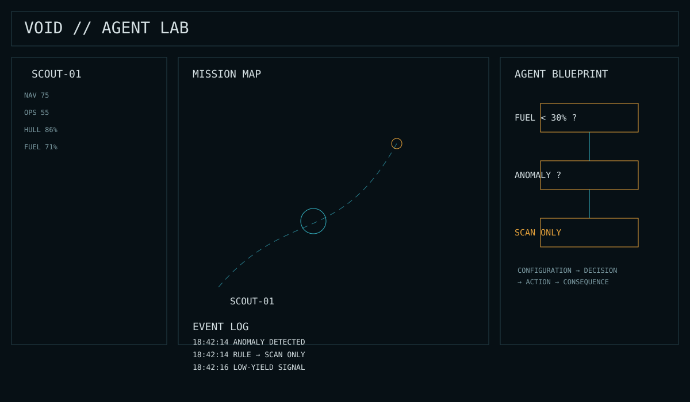

# VOID // AGENT LAB

> ## Don’t control the intelligence. Build it.

**VOID // AGENT LAB** is a dark sci-fi strategy game about designing autonomous agents, deploying them into a deterministic simulation, and learning from what they do.

**You are not the pilot. You are the engineer.**

---

### BUILD → DEPLOY → OBSERVE → OPTIMIZE → EXPAND

Create an agent. Configure its behavior. Send it into the void. Watch it make decisions. Study what happened. Change the rules. Try again.

> **The simulation log is the game.**

---

## What makes it different?

Instead of directly controlling a spaceship, you design the intelligence that controls it.

**Configuration → Decision → Event → Consequence**

The same agent, mission, rules, and seed produce the same result. That makes experimentation meaningful: change one thing, run it again, and learn what changed.

---

## Current prototype

- Agent creation
- Scout & Hauler
- No-code behavioral rules
- Deterministic simulation
- Prospect, Salvage & Courier missions
- Fuel, hull and economy systems
- XP & traits
- Mission event log
- Mission reports
- 1× / 5× / 10× simulation speed
- Local persistence

### Design principles

**No pressure. Real stakes.**

No FOMO, forced timers, daily rewards, forced ads or PvP pressure. But decisions still have consequences: fuel is consumed, hull is damaged, missions can fail, and agents can be lost.

---

## Visual Direction

VOID // AGENT LAB uses an **industrial-cybernetic research console** aesthetic: dark matte surfaces, technical typography, restrained teal/blue and amber accents, schematic graphics, and machine-like telemetry.

The visual signature is the **Agent Blueprint** — a live schematic of the autonomous decision path. During simulation, the active rule path becomes visible alongside the mission map, telemetry, and event log.

The full visual specification is documented in **[Visual Direction →](VISUAL_DIRECTION.md)**.

The visual design principle is simple:

> **Make the intelligence visible.**

## Documentation

**[Read the full Vision →](VISION.md)**

---

## Status

**Prototype / v0.1**

The immediate goal is to prove one thing:

> **Is building and observing autonomous intelligence fun?**
